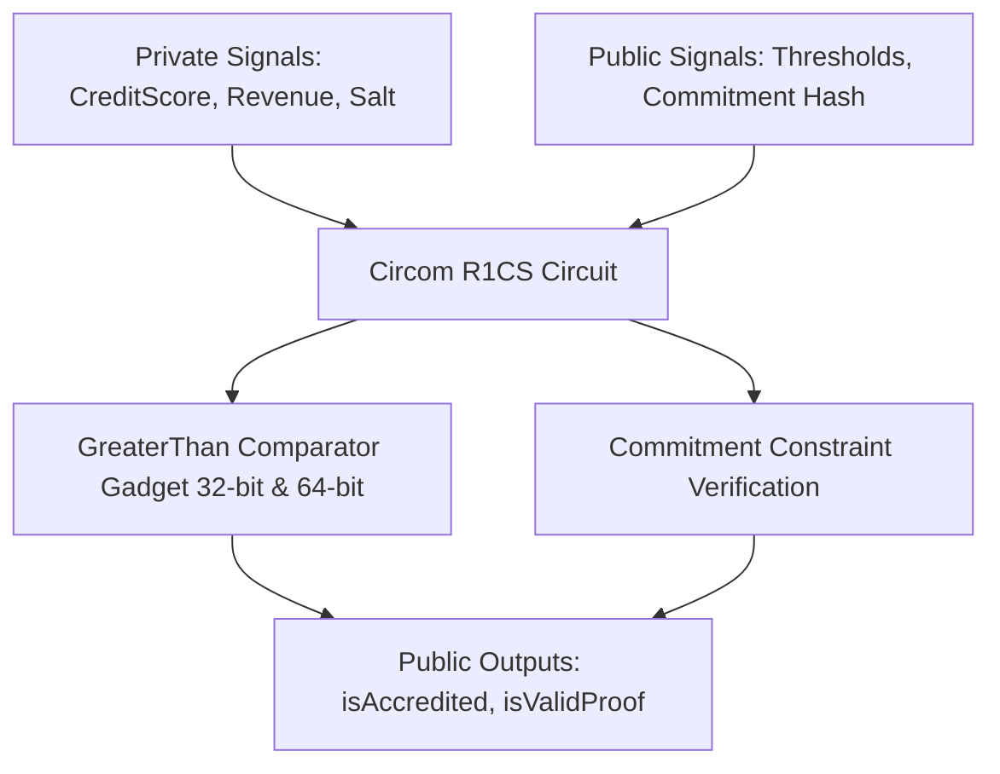

# CIRCOM-ZK-CREDENTIAL-VERIFICATION
# Zero-Knowledge Corporate Credential Verifier (Circom)

## Executive Overview
A privacy-preserving corporate creditworthiness and accreditation verification circuit written in **Circom (v2.1.0)**. It allows enterprises to prove that their private credit score and annual revenues exceed regulatory thresholds and that their corporate identity commitment matches an authoritative ledger **without disclosing raw financial data or identity salts** to auditors.

## Circuit Architecture



### Source Tree
- **`src/credential_verifier.circom`**: Primary arithmetic circuit defining R1CS constraints and threshold comparators.
- **`inputs/input.json`**: Sample private witness parameters and public challenge hashes.
- **`scripts/compile_circuit.sh`**: Compilation script for Circom, SnarkJS, and Groth16 proving system.
- **`runner/run.js`**: JavaScript simulation verifying witness computation and constraint satisfaction.

## Mathematical Formulation: R1CS Constraint Systems
All non-linear relations are compiled into Rank-1 Constraint Systems (R1CS):
$$\mathbf{A}\mathbf{w} \odot \mathbf{B}\mathbf{w} = \mathbf{C}\mathbf{w}$$

Where w is the witness vector containing private inputs, public inputs, and intermediate signals. The boolean comparator gadget enforces:
$$\text{isPositive} \cdot (1 - \text{isPositive}) = 0$$

## Native Circom Compilation
```bash
# Requires circom and snarkjs
bash scripts/compile_circuit.sh
```

## Universal Verification
```bash
node runner/run.js
node orchestrator/run.js --project=11-circom
```

## Senior Interview Q&A
- **Q: Why use Groth16 zk-SNARKs?** Groth16 produces minimal proof sizes (128 bytes) and constant-time verification ($O(1)$ pairings), making it optimal for on-chain smart contracts and high-throughput enterprise verification.
- **Q: How does the circuit prevent underflow attacks?** Subtraction results are constrained using binary bit-decomposition gadgets (`GreaterThan(n)`) ensuring that differences cannot wrap around the prime field $\mathbb{F}_p$.\n
